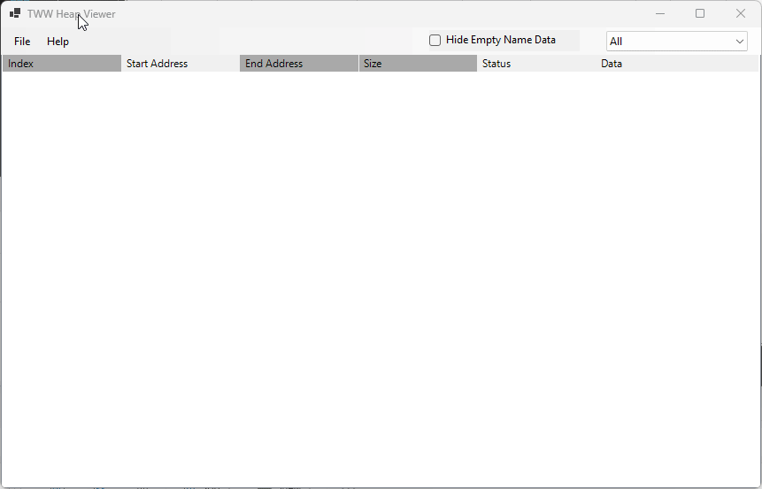
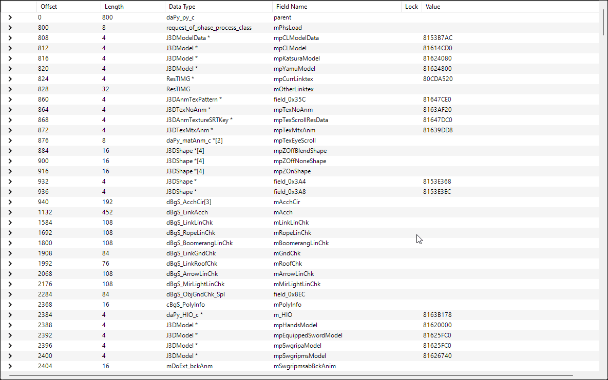

# The Wind Waker Heap Manager
A tool for viewing Zelda Heap memory and viewing/editing actor instance data in real time. Currently supported for 4.0/5.0 versions of Dolphin. JP and NTSC-U are supported.

### View the Free/Used memory of Zelda Heap


### Real time editing data of actor data


## Table of Contents

- [Features](#features)
- [Installation](#installation)
- [Documentation](#documentation)
- [Contributing](#contributing)
- [License](#license)

## Features

- [Modify Data Types](#modify-data-types) 
- Switch between Wind Waker Versions
- Edit mapping behavior

## Installation

1. Clone the repository to your local machine:
```
git clone https://github.com/TrogWW/TWW-Heap-Manager.git
```
2. **Open Solution in Visual Studio:**
   - Launch Visual Studio IDE.
   - Navigate to `File > Open > Project/Solution`.
   - Browse to the location where you downloaded the repository and select the solution file (`.sln`).
3. **Restore NuGet Packages:**
   - Once the solution is loaded, Visual Studio might automatically restore the NuGet packages. If not, you can manually restore them by right-clicking on the solution in the Solution Explorer and selecting "Restore NuGet Packages".
   4. **Build the Solution:**
   - Before running the application, ensure that the solution builds without errors.
   - Navigate to `Build > Build Solution` or simply press `Ctrl + Shift + B`.

## Documentation

### Modify Data Types
This tool comes included with data types from the [TWW Decomp team](https://github.com/zeldaret/tww). 

If you do not have ghidra and wish to edit data types, refer to the Docs folder of this repo to download CSVs generated from Ghidra. You can modify these CSVs manually.

Assuming you have access to a Ghidra project for TWW, to load in your own data types, follow these steps:

1. **Locate Python Script:**
   - In the resources folder of the app, locate the Python script named `ExportStructureDataToCSV.py`.

2. **Make Backup of `ghidra_datatypes.dat`:**
   - If you want to retain the old version of your data types, make a backup of `ghidra_datatypes.dat`.

3. **Load Your TWW Ghidra Project:**
   - Open your TWW Ghidra project.

4. **Navigate to Script Manager:**
   - In Ghidra, navigate to `Window > Script Manager`.

5. **Create Python Script:**
   - Right-click in the Script Manager window, choose `New > Python Script`, and copy-paste the Python code into this script.

6. **Modify Python Script:**
   - Right-click your script, choose `Edit with Basic Editor`, and modify the Python script with the desired output directory.

   ```python
   # Define location for where to output CSV files
   output_directory = 'C:\\Output\\'
   ```
    - You will only need to create this script within Ghidra the first time. The script is saved and can be run again anytime
   


7. Open the Heap Manager App.

8. Navigate to `File` > `Import Ghidra CSVs`.

9. Select the folder that contains your CSVs.

10. Running the import process will take several seconds. The parsed data will be saved into `ghidra_datatypes.dat`.

11. You will not need to run this process again unless you want to update it with new Ghidra data types.

Ensure your Ghidra Data Types have unique names, namespaces are not included to help differentiate between data types.

### Edit Mapping Behavior
When you select an actor in the heap, the app reads the `ProcName` of the instance and refers to the csv file `proc_name_structs.csv`

If the Ghidra structure type the app pulls from is incorrect, add or edit the csv to reference the correct ghidra structure name. You can ignore the FileName,Guess columns
```CSV
ProcName,ProcValue,StructName,FileName,Guess
PROC_OVERLAP0,0,fopAc_ac_c,unmapped.cpp,True
PROC_NEW_ENTRY,5,ghidra_struct_here,unknown,True
```

### Edit English Names
If the english name the heap viewer displays is inccorect or missing, modify `ActorDatabase.json`. This is a large file that was extracted from [Winditor](https://lordned.github.io/Winditor/) that is used by the app to translate in-game names to a more helpful version.


## Contributing

Contributions are welcome! Please follow these steps:

1. Fork the repository.
2. Create a new branch: `git checkout -b feature-branch`.
3. Make your changes and commit them: `git commit -m 'Add some feature'`.
4. Push to the branch: `git push origin feature-branch`.
5. Submit a pull request.

## License

This project is licensed under the [MIT License](LICENSE).
